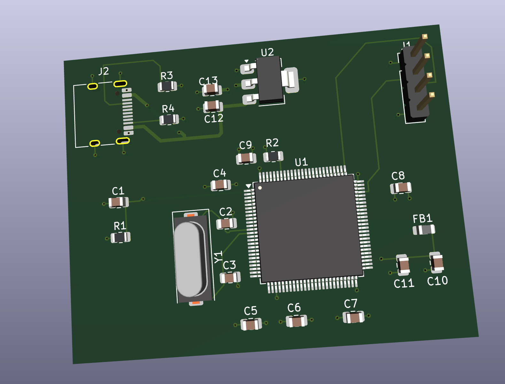
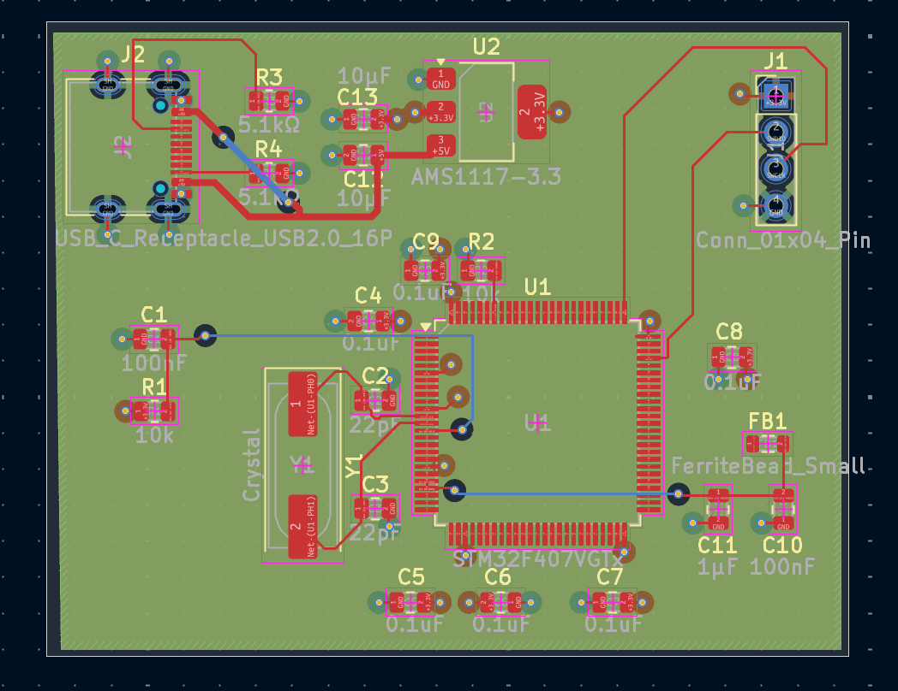
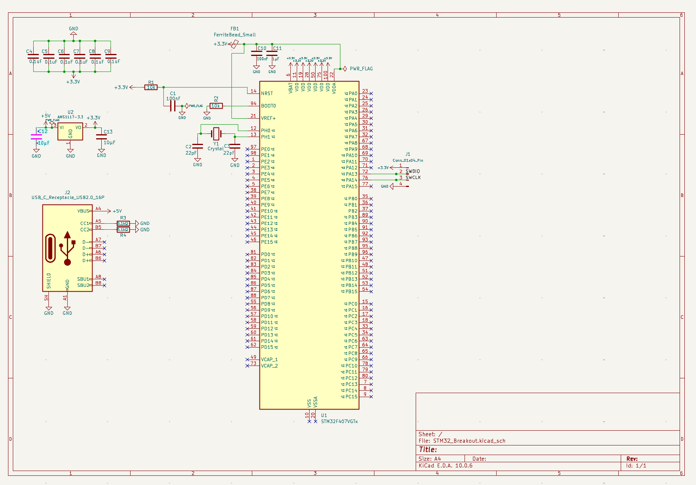

# STM32F407VGTx Yüksek Performanslı 4 Katmanlı PCB Geliştirme Kartı

Bu depo, **STM32F407VGT6** ARM Cortex-M4 mikrodenetleyicisi etrafında tasarlanmış, 4 katmanlı özgün bir basılı devre kartının (PCB) tasarım dosyalarını içermektedir.

Bu projenin temel amacı; gerçek zamanlı kontrol sistemleri, robotik uygulamalar ve yüksek kararlılık gerektiren gömülü sistem prototipleri için endüstriyel standartlarda, gürültüye dayanıklı ve güvenilir bir donanım platformu oluşturmaktır.

---

## Görseller

### 1. 3D Model Görünümü (3D Viewer)


### 2. PCB Tasarımı ve Katman Düzeni (PCB Layout)


### 3. Şematik Tasarım (Schematic Capture)


---

## Donanım Mimarısı ve Öne Çıkan Özellikler

* **Mikrodenetleyici:** STM32F407VGT6 (168 MHz ARM Cortex-M4, Donanımsal FPU, 1 MB Flash, 192 KB RAM).
* **Güç Katı ve Regülasyon:** USB Type-C (+5V) girişi, LDO regülatörüne (AMS1117-3.3) girmeden önce C12 filtresinden geçirilerek filtrelenmiş ve kararlı bir +3.3V hat oluşturulmuştur.
* **Saat/Kristal Devresi:** Hassas sistem zamanlaması için empedans uyumlu ve kısa yollarla tasarlanmış Harici Yüksek Hızlı (HSE) kristal osilatör devresi.
* **Programlama ve Debug Arayüzü:** ST-Link ile kart üzerinde canlı hata ayıklama (Hardware In-Circuit Debugging) imkanı sunan 4 pinli SWD (Serial Wire Debug) konnektörü.
* **Bağlantı ve Koruma:** Şasi/GND koruma via'ları ile izole edilmiş ve paraziti önlenmiş USB 2.0 veri arayüzü.

---

## 4 Katmanlı PCB Stackup ve Güç İzolasyonu (Power Integrity)

Sinyal bütünlüğünü artırmak, elektromanyetik paraziti (EMI) en aza indirmek ve kararlı bir güç dağıtımı sağlamak amacıyla geleneksel 2 katmanlı tasarım yerine **4 katmanlı katman yapısı (stackup)** tercih edilmiştir:

1. **Üst Katman (`F.Cu`):** Yüksek hızlı sinyal hatları (Kristal, USB Veri hatları, SWD) ve bileşen bağlantıları.
2. **İç Katman 1 (`In1.Cu`):** Kesintisiz, düşük empedanslı dönüş yolları sağlayan özel **Toprak Düzlemi (GND Plane)**.
3. **İç Katman 2 (`In2.Cu`):** Düşük endüktanslı güç dağıtımı sağlayan özel **Güç Düzlemi (+3.3V Plane)**.
4. **Alt Katman (`B.Cu`):** İkincil sinyal hatları ve ek termal rahatlama alanı.

---

## Dosya Yapısı

```text
├── Hardware/
│   ├── STM32_Breakout.kicad_pcb    # KiCad PCB Çizim Dosyası
│   ├── STM32_Breakout.kicad_sch    # Şematik Çizim Dosyası
│   └── KiCad Proje Dosyaları
├── Fabrication/
│   ├── Gerbers/                     # Üretime Hazır Gerber Dosyaları
│   └── Drill/                       # Drill (Delik) Dosyaları
├── images/
│   ├── schematic.png                # Şematik Ekran Görüntüsü
│   ├── pcb_layout.png               # PCB Çizim Ekran Görüntüsü
│   └── pcb_3d.png                   # 3D Model Ekran Görüntüsü
└── README.md
